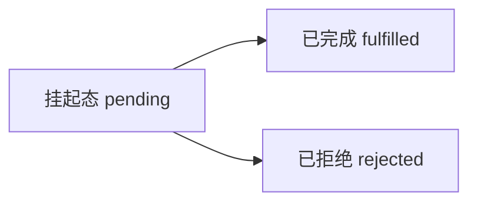

### 第一章 块级绑定
> 变量提升
使用`var`声明的变量，无论其实际声明位置在何处，都会被视为声明于所在函数的顶部（如果不在函数内，则视为在全局作用域的顶部）

#### 块级声明
`块级声明`就是让所声明的变量在指定块的作用域外无法被访问。  
`块级作用域`（又称`词法作用域`）在如下情况被创建：
1. 一个函数内部
2. 代码块（花括号{}包裹）内部

#### let、const
特性：
1. 属于块级声明，声明的变量只能在块级作用域内被访问；
2. 不会变量提升，存在TDZ（暂时性死区），为了在整个代码块内可用，需要手动将声明置顶；
3. 禁止重复声明同名变量；
4. const声明的变量只可在声明时被赋值，对该变量成员（属性）的修改不受限制。
5. 在全局作用域中使用let、const声明变量，变量不会被绑定到`window`对象上。

循环中使用let、const时，在每次迭代中，都会创建一个新的同名变量并对其进行初始化。
```js
var funcs = []
// 使用let声明i
for (let i = 0; i < 10; i++) {
    funcs.push(function() {
        console.log(i);
    })
}

funcs.forEach(function(fun) {
    func(); // 从0到9依次输出
})

// 使用const声明i，在执行i++时会抛出错误
for (const i = 0; i < 10; i++) {
    funcs.push(function() {
        console.log(i);
    })
}

// 可以在`for-in`或`for-of`中使用，效果与let一致，因为这两种循环，没有试图改变i的值。
var funcs = [],
    obj = {
        a: true,
        b: true,
        c: true
    };

// 以下两种写法效果相同
for (let key in obj) {
    funcs.push(function() {
    console.log(key);
})

for (const key in obj) {
    funcs.push(function() {
    console.log(key);
})
```

### 第二章 字符串与正则表达式
这一章节涉及到字符集内容，可先阅读阮一峰老师的文章[Unicode与JavaScript详解](http://www.ruanyifeng.com/blog/2014/12/unicode.html)补充下相关知识。
#### 新增字符串方法
- String.fromCodePoint(): 从Unicode码点返回对应字符
- String.prototype.codePointAt(): 从位置返回对应的码点
- String.prototype.normalize(): 按照指定形式将字符串标准化，便于字符串比较
- String.prototype.includes(): 当前字符串中是否包含另一个给定字符串
- String.prototype.startsWith(): 当前字符串是否以另外一个给定的子字符串开头
- String.prototype.endsWith(): 当前字符串是否以另外一个给定的子字符串结尾
- String.prototype.repeat(): 返回重复构造后的新字符串

#### 正则表达式改动
- 新增了u修饰符，对正则表达式添加4字节码点的支持
- 新增了y修饰符，影响正则表达式搜索时的粘连（sticky）属性，表示从正则表达式的`lastIndex`属性值的位置开始检索字符串中的匹配字符
- 新增了`flags`属性，返回正则表达式中所有标志组成的字符串形式

#### 模板字符串
```js
// 单行字符串
let message1 = `Hello World!`;
console.log(message1); // "Hello World!"

// 多行字符串
let message2 = `Hello 
World!`;
console.log(message2);
// "Hello"
// "World!"

// 制造替换位
let name = "Mike";
console.log(`Hello ${name}`); // "Hello Mike"

// 替换位中进行计算、函数调用等
let a = 10,
    b = 0.035,
    result = `${a} multiplied by ${b} is ${(a * b).toFixed(2)}`;
console.log(result);
```
### 第三章 函数
#### ES6中的函数参数默认值
ES6中的函数参数默认值，只有在未传递或者指定为`undefined`时才会被使用，即使是传入`null`也会被认为是有效的从而不使用默认值。
```js
function makeRequest(url, timeout = 2000, callback = function(){}) {  
    // 函数的其余部分
}

// 使用默认的 timeout 与 callback
makeRequest('/api/getGoodsList');

// 使用默认的 callback
makeRequest('/api/getGoodsList', 500);

// 使用默认的 callback
makeRequest('/api/getGoodsList', null);

// 不使用默认值
makeRequest('/api/getGoodsList', 500， function(body) {
    console.log(body);
});
```

#### 参数默认值与arguments对象
ES5非严格模式下，`arguments`对象总是会被更新以反映出具名参数的变化。
```js
function mixArgs(first, second){
    console.log(first === arguments[0]);  
    console.log(second === arguments[1]); 
    first = "c";
    second = "d";
    console.log(first === arguments[0]);  
    console.log(second === arguments[1]); 
}

mixArgs("a","b");

// 输出结果为： 
true 
true 
true 
true
```
ES5严格模式下，arguments对象不再反映出具名参数的变化。
```js
// 输出结果为： 
true 
true  
false 
false
```

在ES6中（无论是否是严格模式），`arguments`对象的表现与ES5的严格模式下一致，即`arguments`的值始终与实参保持一致，函数体内对函数形参的修改，不会影响到`arguments`。
```js
function mixArgs(first, second = "b"){
    console.log(arguments.length);
    console.log(first === arguments[0]);  
    console.log(second === arguments[1]); // arguments[1] === undefined
    first = "c";
    second = "d";
    console.log(first === arguments[0]);  
    console.log(second === arguments[1]); 
}

mixArgs("a");

// 输出结果为：
1 
true 
false 
false 
false
```
#### 参数默认值表达式
参数默认值并不要求一定是基本类型的值。
```js
let value = 5;
function getValue() {
    return value++;
}

function add(first, second = getValue()) {
    return first + second;
}

console.log(add(1, 1)); // 2
console.log(add(1));  // 6
console.log(add(1));  // 7
```

可以将前面的参数作为后面参数的默认值。
```js
//OK
function add(first, second = first) { 
    return first + second;
}

console.log(add(1)); // 2
```

不可以使用后面的参数作为前面参数的默认值，因为后面的参数还未定义，不可直接使用。
```js
function add(first = second, second) {
    return first + second;
}

console.log(add(undefined, 1)); // Uncaught ReferenceError: Cannot access 'second' before initialization
```

#### 参数默认值的暂时性死区
函数参数与`let`声明的变量相似，在声明之前存在暂时性死区，在其初始化之前不允许被访问。  
> 函数参数拥有各自的作用域和暂时性死区，与函数体的作用域相分离。这意味着参数的默认值不允许访问在函数体内部声明的任意变量。

#### 剩余参数

剩余参数由三个点（`...`）与一个紧跟着的具名参数决定，它是包含传递给函数的其余参数的一个数组。
```js
// keys是一个在object之后的所有参数组成的数组。
function pick(object, ...keys){
    let result = Object.create(null);
    
    for (let i = 0, len = keys.length; i < len; i++){
        result[keys[i]] = object[keys[i]];
    }
    
    return result;
}
```
剩余参数的两点限制条件：  
1. 一个函数只能有一个剩余参数，并且必须放在最后。  
2. 剩余参数不能在对象字面量的`setter`属性中使用。（原因是对象字面量的setter被限定只能使用单个参数）
```js
// SyntaxError: Rest parameter must be last formal parameter
function pick(object, ...keys, last) {
    let result = Object.create(null);
    
    for (let i = 0, len = keys.length; i < len; i++){
        result[keys[i]] = object[keys[i]];
    }
    
    return result;
}

// SyntaxError: Setter function argument must not be a rest parameter
let object = {
    set name(...value) {
        // 一些操作
    }
};
```

#### 扩展运算符
剩余参数允许我们把多个独立的参数合并到一个数组中，而扩展运算符则允许将一个数组分割，并将各个项作为分离的参数传给函数。在大部分场景中，扩展运算符都是`apply()`方法的合适替代品。
```js
// ES6之前

// Math.max()只允许分开传入每个需要比较的值
console.log(Math.max(25, 50, 75, 100)); // 100

// 给数组中各个值比较时需要借助apply
let values = [25, 50, 75, 100];
console.log(Math.max.apply(Math, values));   // 100

// ES6
console.log(Math.max(...values));   // 100
```

#### 名称属性
ES6给所有的函数添加了name属性。
```js
// 函数自身具有函数名
function function1() {
    // 函数内容
}
console.log(function1.name); // "function1"

// 函数表达式
var function2 = function() {
    // 函数内容
}
console.log(function2.name); // "function2"
```

自身函数名的优先级高于赋值目标
```js
var function3 = function function4() {
    // 函数内容
}
console.log(function3.name); // "function4"
```

对象的`getter`及方法的名称
```js
let person = {
    get firstName() {
        return "Nicholas"
    }
    sayName: function() {
        console.log(thsi.name)
    }
}
console.log(person.sayName.name); // "sayName"
let descriptor = Object.getOwnPropertyDescriptor(person, 'firstName');
console.log(descriptor.get.name); // "get firstName"
```

使用`bind()`创建的函数及`Function`构造器构造的函数
```js
var doSomething = function () {
    // 函数内容
}
console.log(doSomething.bind().name); // "bound doSomethind"
console.log((new Function().name);  // "anonymous"
```

#### 函数的双重用途
JS为函数提供了两个不同的内部方法：`[[Call]]`和`[[Construct]]`。
- 当函数未使用new进行调用时，`[[Call]]`方法会被调用，运行代码中显示的函数体。
- 当函数使用new进行调用时，`[[Construct]]`方法会被执行，负责创建一个被称为新目标的新的对象，并且使用该新目标作为this去执行函数体，最后将该对象作为函数的返回值。
```js
function Person(name){
    this.name = name;
}

var person = new Person("Nicholas");
var notAPerson = Person("Nicholas");

console.log(person); // "[Object,Object]"
console.log(notAPerson); // "undefined"
```
#### new.target
ES6引入了`new.target`元属性。`元属性`指的是“非对象”上的一个属性，并提供关联到它的目标的附加信息。当函数的`[[Construct]`方法被调用时，`new.target`会被填入`new`运算符的作用目标（构造器）。而`[[Call]]`被执行，`new.target`的值则会是`undefined`。
```js
function Person(name) {
    if(new.target === Person) {
        this.name = name;
    } else {
        throw new Error("You must use new with Person.")
    }
}
let person = new Person("Jack"); // ok
let anotherPerson = Person('Bob'); // Error "You must use new width Person."
```
#### 块级函数
块级函数是指在代码块中声明函数。
严格模式下，ES5中会抛出语法错误。ES6会将该函数视为块级声明，并将其声明提升至代码块顶部，允许它在块内部被访问，块外部无法访问到。
```js
"use strict"
if (true) {  
    function doSomething() {
        // 函数体
    }
}

// 代码块外部无法访问到该函数
console.log(typeof doSomething); // "undefined"
```
非严格模式下，ES6会将该函数声明提升至所在函数或全局环境的顶部，而不是代码块的顶部。
```js
if (true) { 
    console.log(typeof doSomething); // "function"

    function doSomething() {
        // 函数体
    }
}

console.log(typeof doSomething);  // "function"
```

#### 箭头函数
与传统JS函数的差异：
- 没有`this`、`super`、`arguments`及`new.target`绑定，`this`、`super`、`arguments`及`new.target`的值由所在的、最靠近的非箭头函数来决定；
- 不能被使用`new`调用；
- 没有原型；
- 不能更改`this`；
- 不允许重复的具名参数，传统的函数中参数可以重名。

语法形式：
```js
// 无参数
var getName = () => 'Jack';

// 单个参数
var reflect = value => value;

// 多个参数
var sum = (value1, value2) => value2 + value2;

// 返回一个对象字面量
var getPersonInfo = id => ({ id: id, name: 'Jack'});

// 传统的函数体
var sum = （value1, value2) => {
    return value1 + value2;
}
```

#### 立即调用函数表达式（IIFE）
```js
// 传统写法
let person = function(name) {
    return {
        getName: function() {
            return name;
        }
    };
}("Jack");
console.log(person.getName()); // "Jack"

// 箭头函数写法
let person = ((name) => {
    return {
        getName: function() {
            return name;
        }
    }
})('Jack');
console.log(person.getName()); // "Jack"
```

#### 尾调用优化
**尾调用**：函数的最后一步（不一定非在函数尾部）是调用另一个函数。  
ES5引擎中实现的尾调用，其处理就像其他函数一样：一个新的帧栈被创建并推到调用栈之上，用于表示该次函数调用，这意味着之前每次帧栈都保留在内存中，当调用栈太大时会出现超出报错，进行尾调用优化可以大大节省内存。  
ES6严格模式下，同时满足以下条件时，ES6引擎会自动进行尾调用优化（清除当前帧栈并在此利用它，而不是为尾调用创建新的帧栈）：
- 尾调用不能引用当前帧栈中的变量（意味着该函数不能是闭包）；
- 进行尾调用的函数在尾调用返回结果后不能做额外操作；
- 尾调用的结果作为当前函数的返回值  
```js
// 尾调用
function f(x){
  return g(x);
}

// 尾调用
function f(x) {
  if (x > 0) {
    return m(x)
  }
  return n(x);
}

// 不是尾调用，无法被优化
function f(x){
  let y = g(x);
  return y;
}

function f(x){
  return g(x) + 1;
}
```

#### 尾递归
函数调用自身，称为`递归`。如果尾调用自身，就称为`尾递归`。  
尾调用优化的主要用例是在递归函数中，在其中的优化具有最大效果。
```js
// 不是尾调用，无法被优化，复杂度O(n)
function factorial(n) {
    if(n === 1) return 1;
    return n * factorial(n-1);
}

// 改写为尾递归，复杂度O(1)
function factorial(n, result = 1) {
    if(n === 1) return result;
    return factorial(n-1, n * result); 
}
```

### 第四章 扩展的对象功能

#### 对象类别
ES6规范明确的对象类别包括：  
- 普通对象：拥有JS对象所有默认的内部行为。
- 奇异对象：其内部行为在某些方便有别于默认行为。
- 标准对象：在ES6中被定义的对象。标准对象可以是普通的，也可以是奇异的。
- 内置对象：在脚本开始运行时由JS运行环境提供的对象。所有的标准对象都是内置对象。

#### 属性简写
属性名与赋值变量名同名时，可以简写。
```js
function createPerson(name, age) {
    return {
        name,
        age
    }
    // 等价于
    return {
        name: name,
        age: age
    }
}
```

#### 方法简写
可以省略冒号与`function`关键字。简写的方法中可以使用<a href="#super">`super`</a>，非简写的方法不能使用。
```js
let person = {
    name: 'Nicholas',
    sayName() {
        console.log(this.name);
    }
    // 等价于
    sayName: function() {
        console.log(this.name);
    }
}
```

#### 计算属性名
ES5及之前，对象实例上才能使用`计算属性名`。
```js
let person = {}, 
    firstName = "first name";

person[firstName] = "Jack";

console.log(person[firstName]); //Jack
```

ES6中，对象字面量上可以直接使用计算属性名。
```js
let firstName = "first name";
let person = {
    [firstName]: 'Jack'
}
```

#### `Object.is()`方法
严格相等运算符`===`存在两个怪异点：
- `+0 === -0`会返回`true`
- `NaN === NaN`会返回`false`  

`Object.is()`弥补了上述两个问题，其他比较结果与`===`一致。
```js
console.log(+0 === -0); //true
console.log(Object.is(+0, -0)); //false

console.log(NaN === NaN); // false
console.log(Object.is(NaN, NaN)); // true

console.log(5 === "5"); // false
console.log(Object.is(5, "5")); // false
```

#### `Object.assign()`方法

用于将所有可枚举属性的值从一个或多个源对象分配到目标对象，并返回目标对象。  

如果目标对象中的属性具有相同的键，则属性将被源对象中的属性覆盖。后面的源对象的属性将类似地覆盖前面的源对象的属性。
值得注意的是，使用`Object.assign()`会将源对象上的访问器属性（如果有的话）转变为目标对象上的数据属性，所以有访问器属性的源对象使用`Object.assign()`时要谨慎。

```js
const target = { a: 1, b: 2 };
const source = { b: 4, c: 5 };

const returnedTarget = Object.assign(target, source);

console.log(target);
// Object { a: 1, b: 4, c: 5 }

console.log(returnedTarget);
// Object { a: 1, b: 4, c: 5 }
```

#### 自有属性的枚举顺序

ES6严格定义了对象自有属性在被枚举时返回的顺序。自有枚举属性枚举时基本顺序如下：
1. 所有的数字类型键，按升序排列。
2. 所有的字符串类型键，按被添加到对象的顺序排列。
3. 所有的符号类型键，也按添加顺序排列。

这个规则对`Object.getOwnPorpertyNames()`、`Reflct.ownKeys`及`Object.assign()`方法有影响，`for-in`、`Object.keys()`循环的枚举顺序
仍未被明确规定，可能因JS引擎而异。
```js
var obj = {
    a: 1,
    0: 1,
    c: 1,
    2: 1,
    b: 1,
    1: 1
};
obj.d = 1;
console.log(Object.getOwnPropertyNames(obj).join("")); // "012acbd"
```

#### `Object.setPrototypeOf()`修改对象的原型

此方法允许你修改任意指定对象的原型，接受两个参数：需要被修改原型的对象，以及将会成为前者原型的对象。

```js
let person = {
  getGreeting() {
    return "Hello";
  }
};

let dog = {
  getGreeting() {
    return "Woof";
  }
};

let friend = Object.create(person);
console.log(friend.getGreeting()); // "Hello"
console.log(Object.getPrototypeOf(friend) === person); // true

// 重设原型
Object.setPrototypeOf(friend, dog);
console.log(friend.getGreeting()); // "Woof"
console.log(Object.getPrototypeOf(friend) === dog); // true
```

#### <span id="super">使用`super`访问原型</span>

`super`是指向当前对象的原型的一个指针，实际上就是`Object.getPrototypeOf(this)`的值。

```js
let friend = {
  // 重写getGreeting方法，其中调用了原型上的同名方法
  getGreeting() {
    return super.getGreeting() + ", Nice to meet you!"; 
    // 等价于
    return Object.getPrototypeOf(this).getGreeting().call(this) + ", Nice to meet you!";
  }
  
  // 非简写语法会报错
  getGreeting: function() {
    return super.getGreeting() + ", Nice to meet you!"; // SyntaxError: 'super' keyword unexpected here
  }
}
```

#### 正式的“方法”定义

**方法**是一个拥有`[[HomeObject]]`内部属性的函数，此内部属性指向该方法所属的对象。

```js
let preson = {
	// 方法
  getGreeting() {
    return "Hello";
  }
};

// 不是方法
function shareGreeting() {
  return "Hi";
}
```

### 第五章 解构
#### 对象解构

对象解构语法在赋值语句的左侧使用了对象字面量。

```js
let node = {
  type: "Identifier",
  name: 'foo'
};
// 变量声明时使用解构赋值
let { type, name } = node;

// 变量声明之后使用解构赋值，要使用()包裹，否则{}会被认为是代码块而报错
let type = "Literal";
let name = 5;
({ type, name } = node);

console.log(type); // "Identifier"
console.log(name); // "foo"
```

##### 默认值

给变量进行解构赋值时，如果在对象中没有找到同名属性，该变量会被赋值为`undefined`。可以给变量定义一个默认值，以便在属性不存在或属性值为`undefined`时使用该值。

```js
let node = {
  type: "Identifier",
  name: 'foo'
};
// 变量声明时使用解构赋值
let { type, name, value = true } = node;

console.log(type); // "Identifier"
console.log(name); // "foo"
console.log(value); // true
```

##### 变量名与属性名不一致

使用`[propertyName]:[variableName]`的语法形式进行解构。

```js
let node = {
  type: "Identifier",
  name: 'foo'
};
// 将node上的type、name、value分别解构赋值给localType、localName、localValue
let { type: localType, name: localName, value: localValue = true } = node;

console.log(localType); // "Identifier"
console.log(localName); // "foo"
console.log(localValue); // true
```

##### 嵌套的对象解构

```js
let node = {
  type: "Identifier",
  name: 'foo',
  loc: {
    start: {
      line: 1,
      column: 2
    }
  }
};

let { loc: { start } } = node;
console.log(start.line); // 1
console.log(start.column); // 2
```

#### 数组解构

语法与对象结构相似，解构作用在数组内部的位置上。（对象解构作用在对象的具名属性上）。

```js
let colors = ['red', 'green', 'blue']

let [ firstColor, secondColor ] = colors;
let [ , , thirdColor ] = colors;

console.log(firstColor); // 'red'
console.log(secondColor); // 'green'
console.log(thirdColor); // 'blue'
```

数组解构巧用：交换变量的值

```js
let a = 1, 
    b = 2, 
    c = 3;

[a, b, c] = [c, a, b];

console.log(a); // 3
console.log(b); // 1
console.log(c); // 2
```

##### 默认值

变量对应位置的值不存在或者等于`undefined`时，变量会使用默认值。

```js
let colors = ['red'];

let [ firstColor, secondColor = "green" ] = colors;

console.log(secondColor); // "green"
```

##### 嵌套的数组解构

```js
let colors = ['red', ['green', 'blue']];

let [ firstColor, [ secondColor ]] = colors;

console.log(secondColor); // 'green'
```

##### 剩余项

使用`...`语法将数组剩余的项目赋值给一个指定的变量。剩余项必须是数组解构模式中最后的部分。

```js
let colors = ['red', 'green', 'blue']

let [ firstColor, ...restColors ] = colors;

console.log(firstColor); // 'red'
console.log(restColors); // ['green', 'blue']

// 利用剩余项克隆数组
let [...cloneColors] = colors;
console.log(cloneColors); // ['red', 'green', 'blue']
```

#### 混合解构

对象与数组解构混合使用

```js
let node = {
  type: "Identifier",
  name: 'foo',
  loc: {
    start: {
      line: 1,
      column: 2
    }
  },
  range: [0, 3]
};

let { loc: { start }, range: [startIndex] } = node;
console.log(start.line); // 1
console.log(start.column); // 2
console.log(startIndex); // 0
```

#### 参数解构

对于非必需且无顺序要求的参数，可使用对象或数组的解构来替代具名参数，这样可以很方便的通过查看函数定义就能判断出函数所期望的输入。

```js
// 传统写法
function setCookie(name, value, options) {
  options = options || {};
  let secure = options.secure,
      path = options.path,
      domain = options.domain,
      expires = options.expires;
  
  // 设置cookie的代码
}

// ES6 解构改写
function setCookie(name, value, { secure, path, domain, expires }) {  
  // 设置cookie的代码
}

setCookie('type', 'js', {
  secure: true,
  expires: 60000
});
```

##### 参数解构的默认值

上述示例中， 若不传递第三个参数，函数调用会因为解构出错而报错，若要解构的参数是非必选参数，可以通过给解构的参数提供默认值来解决这个问题。

```js
// 解构参数设置默认值
function setCookie(name, value, { secure, path, domain, expires } = {}) {  
  // 设置cookie的代码
}

// 也可以给每个参数指定默认值
function setCookie(name, value, { 
  	secure = false, 
  	path = "/", 
  	domain = "example.com", 
  	expires = new Date(Date.now() + 360000000) 
	} = {}) {  
  // 设置cookie的代码
}
```

### 第六章 符号与符号属性
JS已有的基本类型： `string`、`number`、`boolean`、`null`、`undefined`

ES6中新增的基本类型：`Symbol`（符号） 

#### 创建符号值

符号没有字面量形式，可以使用全局`Symbol`函数来创建一个符号值。

```js
let firstName = Symbol();  // 因为是基本类型，不能使用new关键字，会报错function is not a constructor 
let person = {}; 
person[firstName] = "Nicholas";  

console.log(person[firstName]); // "Nicholas"
```

`Symbol`接受一个额外的参数用于描述符号值，描述信息存储在内部属性`[[Description]]`中，当符号的`toString()`方法被显式或隐式调用时，该属性会被读取。该描述不能用来访问对应属性，但能用于调试。

```js
let firstName = Symbol("first name");  // 因为是基本类型，不能使用new关键字，会报错function is not a constructor 
let person = {}; 
person[firstName] = "Nicholas";  

console.log(person[firstName]); // "Nicholas 
console.log(firstName); // "Symbol(first name)"

// 识别符号值，优先使用typeof运算符 
console.log(typeof firstName);  // "symbol"
```

#### 使用符号值

可以在需计算属性名的场合，也可以在`Object.defineProperty()`或`Object.defineProperties()`中使用。

```js
let firstName = Symbol("first name"); 

// 使用一个需计算字面量属性 
let person = {    
  [firstName]: "Nicholas" 
}; 

// 让该属性变为只读 
Object.defineProperty(person, firstName, { writable: false });

let lastName = Symbol("last name"); 
Object.defineProperties(person, {     
  [lastName]: {        
    value: "Zakas",        
    writable: false    
  } 
}); 

console.log(person[firstName]); // "Nicholas" 
console.log(person[lastName]);  // "Zakas"
```

#### 共享符号值

ES6提供了`全局符号注册表`，可以跨越文件或代码来追踪符号值。

`全局符号注册表`类似于全局作用域，是一个共享环境，这意味着你不应当假设某些值是否已存在于其中。

使用`Symbol.for()`方法来创建共享符号值，该方法仅接受单个字符串类型的参数，作为目标符号值的标识符，同时该参数也会成为该符号的描述信息。

使用`Symbol.for()`会先检索全局符号注册表中是否存在该符号值，若存在则返回该值，若不存在则会新创建一个符号值到全局注册表中，然后再返回该值。

```js
let uid = Symbol.for("uid");  
let object = {}; 

object[uid] = "12345"; 

console.log(object[uid]); // "12345"  
console.log(uid); // "Symbol(uid)"

let uid2 = Symbol.for("uid");

console.log(uid === uid2); // true
console.log(object[uid2]); // "12345"
console.log(uid2); // "Symbol(uid)"
```

可以使用 `Symbol.keyFor()` 方法在全局符号注册表中根据符号值检索出对应的键值

```js
let uid = Symbol.for("uid");  
console.log(Symbol.keyFor(uid)); // "uid" 

let uid2 = Symbol.for("uid");  
console.log(Symbol.keyFor(uid2)); // "uid" 

let uid3 = Symbol("uid"); 
console.log(Symbol.keyFor(uid3)); // undefined
```

#### 符号值的转换

符号值无法被转换为字符串值或数值

```js
let uid = Symbol.for("uid");  // 这里是隐式调用了符号的String()方法 
console.log(uid); // "Symbol(uid)"  

// 利用+转换为字符串，会引发错误 
let desc = uid + ""; // 引发错误! 

//使用数学运算符，也会引发错误 
let sum = uid / 1; // 引发错误! 

// 使用逻辑运算符是可以的，符号值在逻辑运算中等价于true 
let flag = Boolean(uid) || false; // true 
flag = !uid && true; // false
```

#### 检索符号属性

`Object.getOwnPropertySymbols()`用于检索对象的符号类型属性，返回对象中符号值类型的自有属性名组成的数组。

```js
let uid = Symbol.for("uid"); 
let object = {    
  [uid]: "12345" 
};

let symbols = Object.getOwnPropertySymbols(object); 

console.log(symbols.length);  // 1 
console.log(symbols[0]);      // "Symbol(uid)" 
console.log(object[symbols[0]]); // "12345"
```

#### 使用知名符号暴露内部方法

ES6定义了“知名符号”来代表 JS 中一些公共行为，而这些行为此前被认为只能是内部操作。每一个知名符号都对应全局 Symbol 对象的一个属性，这些知名符号是：

- `Symbol.hasInstance`：供instanceof 运算符使用的一个方法，用于判断对象继承关 系。
- `Symbol.isConcatSpreadable`：一个布尔类型值，在集合对象作为参数传递给Array.prototype.concat() 方法时，指示是否要将该集合的元素扁平化。
- `Symbol.iterator`：返回迭代器(参阅第七章)的一个方法。
- `Symbol.match`：供 String.prototype.match() 函数使用的一个方法，用于比较字符串。
- `Symbol.replace`：供 String.prototype.replace() 函数使用的一个方法，用于替换子字符串。
- `Symbol.search`：供 String.prototype.search() 函数使用的一个方法，用于定位子字符串。
- `Symbol.species`：用于产生派生对象(参阅第八章)的构造器。
- `Symbol.split`：供String.prototype.split() 函数使用的一个方法，用于分割字符串。
- `Symbol.toPrimitive`：返回对象所对应的基本类型值的一个方法。
- `Symbol.toStringTag`：供 String.prototype.toString() 函数使用的一个方法，用于创建对象的描述信息。
- `Symbol.unscopables`：一个对象，该对象的属性指示了哪些属性名不允许被包含在 with 语句中。

### 第七章 Set和Map
#### Set
`Set`是不包含重复值的有序列表，常用来检查某个值是否存在。  
##### Set的方法
- `add()`: 添加值
- `has()`: 测试值是否存在
- `delete()`: 删除单个值
- `clear()`: 清除所有值

示例代码：  
```js
let set = new Set();

set.add(5);
set.add('5');
console.log(set.size);  //2 
console.log(set.has(5)); //true

set.delete(5);
console.log(set.has(5)); //false
console.log(set.size);  //1

set.clear();
console.log(set.size); //0
```

##### Set上的forEach方法
与数组上的`forEach`方法类似，接收一个回调函数，回调函数接收三个参数：
1. Set中下个位置的值
2. Set中下个位置的值
3. 目标Set自身

示例代码： 
```js
let set = new Set([1,2,3]);
set.forEach((value, key, ownerSet) => {
    console.log(value+", "+key);
    console.log(ownerSet === set);
});

// 输出结果
1, 1
true
2, 2 
true
3, 3 
true
```

##### 利用Set为数组去重
```js
function eliminateDuplicates(items){
    return [...new Set(items)];
}

let numbers = [1,2,3,3,3,3,4];

let noDuplicates = eliminateDuplicates(numbers);
console.log(noDuplicates);  // [1,2,3,4]
```

#### Weak Set
`Weak Set`类型只允许存储对象弱引用，不能存储基本类型的值。对象的弱引用在它成为该对象的唯一引用时，不会阻止垃圾回收。
##### Weak Set的方法
- add()
- has()
- delete()  

示例代码：
```js
let set = new Set(), key = {};

set.add(key);
console.log(set.has(key)); //true

// 移除对象的强引用，set中的引用依然还在
key = null;
console.log(set.size); //1


let weakSet = new WeakSet();
weakSet.add(key);
console.log(weakSet.has(key)); //true

// 移除对于该对象的最后一个强引用，Weak Set中的引用会自动解除
key = null;
```
##### 与Set的关键差异
- 不可添加非对象，会抛出错误
- 不可迭代，不可使用`for-of`、`keys()`、`values()`及`forEach()`方法
- 没有`size`属性和`clear()`方法

#### Map  
`Map`类型是键值对的`有序列表`，常用作缓存，存储数据以便以后快速检索。`Map`的`键`和`值`都可以是`任意类型`。
##### Map的方法
- `set(key,value)`: 给`Map`添加项 
- `get(key)`: 提取键值对应的值
- `has(key)`：判断键是否存在于`Map`中
- `delete(key)`：移除Map中的键以及对应的值
- `clear()`： 移除Map中所有的键与值

示例代码：  
```js
let map = new Map();
map.set("name", "Jack");
map.set("age", 25);
console.log(map.size); // 2
console.log(map.has("name"); // true
console.log(map.get("name")); // "Jack"

map.delete("name");
console.log(map.size);  // 1
console.log(map.has("name")); // false
console.log(map.get("name")); // undefined

map.clear();
console.log(map.size); //0
```
##### Map上的forEach方法
接收一个能接收三个参数的回调函数：  
1. Map中下个位置的值
2. 该值所对应的键
3. 目标Map本身

示例代码：
```js
let map = new Map([["name", "Nicholas"], ["age", 20]]);
map.forEach(function(value, key, ownerMap){
    console.log(key + ", " + value);
    console.log(ownerMap === map);
});

// 输出结果
name,Nicholas
true
age, 20
true
```

#### Weak Map
Map的弱引用方式（键才是弱引用，值不是），所有的键都必须是非空的对象，值可以是任意类型。
##### Weak Map的方法
- `set()`: 添加数据
- `get()`: 提取数据 
- `has()`: 判断指定的键是否存在于Map中
- `delete()`: 移除一个特定的键值对

示例代码：
```js
let map = new weakMap(),
    element = document.querySelector(".element");
    
map.set(element, "Original");

console.log(map.has(element));  // true
console.log(map.get(element));  // "Original"

element.parentNode.removeChild(element);
element = null;          // weakMap中对应的数据也会被移除    
```

##### 与Map的差异
- Weak Map只接受非空对象作为键值
- 不可迭代和枚举
- 没有`size`属性和`clear()`方法

### 第八章 迭代器和生成器
#### 何为迭代器
迭代器是被设计专用于迭代的对象，带有特定接口。所有的迭代器对象都拥有`next()`方法，会返回一个`结果对象`。该`结果对象`有两个属性：
- `value`: 下一个值
- `done`: 是否迭代完成
`ES5`中迭代器简易实现：
```js
function createIterator(items) {
    var i = 0;
    return {
        next: function() {
            var done = (i >= items.length);
            var value = !done ? items[i++] : undefined;
            return {
                done: done,
                value: value
            };
        }
    };
}

// 生成迭代器
var iterator = createIterator([1, 2, 3]);

console.log(iterator.next()) // {done: false, value: 1}
console.log(iterator.next()) // {done: false, value: 2}
console.log(iterator.next()) // {done: false, value: 3}
console.log(iterator.next()) // {done: true, value: undefined}
```

#### 何为生成器
生成器是能返回一个迭代器的函数。生成器函数由放在`function`关键字之后的一个星号`*`来表示，并能使用新的关键字`yield`。
> `yield`关键字只能用在生成器内部，用于其他位置会被认为是语法错误。
```js
// 生成器
function *createIterator() {
    yield 1;
    yield 2;
    yield 3;
}

let iterator = createIterator();
console.log(iterator.next()); // {done: false, value: 1}
console.log(iterator.next()); // {done: false, value: 2}
console.log(iterator.next()); // {done: false, value: 3}
console.log(iterator.next()); // {done: true, value: undefined}
```
> 可以创建生成器函数表达式，不可以使用箭头函数。
```js
const createIterator = function *(items) {
    for (let i = 0; i < items.length; i++) {
        yield items[i]
    }
}

let iterator = createIterator([1, 2, 3]);
console.log(iterator.next()); // {done: false, value: 1}
// ...
```

#### 访问默认迭代器
<span id="iterableObject">可迭代对象</span>是包含`Symbol.iterator`属性的对象。`for-of`只可用在可迭代对象上。常用的`数组`、`Set`、`Map`以及`字符串`都是可迭代对象，用户自定义创建的对象默认不是可迭代对象。    
`Symbol.iterator`定义了为指定对象返回迭代器的函数，可以使用`Symbol.iterator`来访问对象上的默认迭代器。

```js
let values = [1, 2, 3];
let iterator = values[Symbol.iterator]();

console.log(iterator.next()); // {done: false, value: 1}
```
可以使用`Symbol.iterator`来检测一个对象是否能进行迭代。

```js
function isIterable(object) {
    return typeof object[Symbol.iterator] === 'function';
}
```

#### 创建可迭代对象
为自定义的对象添加`Symbol.iterator`属性，可以使其成为可迭代对象。
```js
let o = {
    a: 1,
    b: 2,
    *[Symbol.iterator]() {
        for (let key in this) {
            yield this[key];
        }
    }
}

for (let item of o) {
    console.log(item) // 1 2
}
```

#### 集合的迭代器
ES6中的三种集合对象类型（数组、`Map`和`Set`），都拥有如下迭代器：
- `entries()`：返回一个包含键值对的迭代器；
- `values()`：返回一个包含集合中的值的迭代器；
- `keys()`：返回一个包含集合中的建的迭代器。
`values()`是数组与`Set`的默认迭代器，`entries()`是`Map`的默认迭代器。

#### 扩展运算符与非数组的可迭代对象
扩展运算符能作用域所有可迭代对象，并且会使用默认迭代器来判断需要使用哪些值。  
作用于`Set`：
```js
let set = new Set([1, 2, 3, 3, 4, 4, 5]),
    array = [...set];

console.log(array); // [1, 2, 3, 4, 5]
```
作用于`Map`：
```js
let map = new Map(["name", "Nicholas"], ["age", 25]),
    array = [...map];

console.log(array); // [ ["name", "Nicholas"], ["age", 25]]
```
作用于字符串：
```js
let str = "hello world",
    array = [...str];

console.log(array); // ["h","e","l","l","o"," ","w","o","r","l","d"]
```

#### 传递参数给迭代器
可以通过`next()`方法向迭代器传递参数，该参数会成为生成器内部`yield`语句的值。
> 注：`yield语句`是指上次生成器中断执行出得语句。
```js
function *createIterator() { 
    let first = yield 1; 
    let second = yield first + 2;  // 4 + 2 
    yield second + 3;              // 5 + 3 
}

let iterator = createIterator(); 
console.log(iterator.next());      // "{ value: 1, done: false }" 
console.log(iterator.next(4));     // "{ value: 6, done: false }" 
console.log(iterator.next(5));     // "{ value: 8, done: false }" 
console.log(iterator.next());      // "{ value: undefined, done: true }"
```
对于`next()`的首次调用，传递给它的任一参数都会被忽略。

#### 迭代器中抛出错误
传递错误对象给迭代器的`throw()`方法，可以让迭代器抛出该错误。
```js
function *createIterator() { 
    let first = yield 1; 
    let second = yield first + 2; // yield 4 + 2 ，然后抛出错误 
    yield second + 3; // 永不会被执行 
}

let iterator = createIterator(); 
console.log(iterator.next()); // "{ value: 1, done: false }" 
console.log(iterator.next(4)); // "{ value: 6, done: false }" 
console.log(iterator.throw(new Error("Boom"))); // 从生成器中抛出了错误
```
可以使用`try-catch`来捕捉错误。
```js
function *createIterator() { 
    let first = yield 1; 

    try {
        let second = yield first + 2; // yield 4 + 2 ，然后抛出错误 
    } catch(e) {
        second = 6;                   // 捕捉到错误时，赋予新值
    }
    yield second + 3;
}

let iterator = createIterator(); 
console.log(iterator.next()); // "{ value: 1, done: false }" 
console.log(iterator.next(4)); // "{ value: 6, done: false }" 
console.log(iterator.throw(new Error("Boom"))); // "{ value: 9, done: false }" 
```

#### 生成器的`Return`语句
生成器中使用`return`，可以让生成器在指定位置退出执行，且指定最后一次调用`next()`的返回值。使用`return`语句，`done`属性会被设置为`true`。
```js
function *createIterator() { 
    yield 1; 
    return 99; 
    yield 2; 
    yield 3; 
}

let iterator = createIterator(); 
console.log(iterator.next()); // "{ value: 1, done: false }" 
console.log(iterator.next()); // "{ value: 99, done: true }"
```

#### 生成器委托
可以将多个生成器合并成一个生成器来使用，该合并后的生成器创建出来的迭代器从外部来看就是一个单一的迭代器。该迭代器在`next()`调用过程中，
会委托给合适的生成器。合并后的生成器中，可以
```js
function *createNumberIterator() { 
    yield 1; 
    yield 2; 
    return 3; 
}

function *createRepeatingIterator(count) { 
    for (let i=0; i < count; i++) { 
        yield "repeat"; 
    } 
}

function *createCombinedIterator() { 
    let result = yield *createNumberIterator(); // 第3次调用next()时result会被赋值为3，并传递给下一个生成器
    yield *createRepeatingIterator(result); 
}

var iterator = createCombinedIterator(); 
console.log(iterator.next()); // "{ value: 1, done: false }" 
console.log(iterator.next()); // "{ value: 2, done: false }" 
console.log(iterator.next()); // "{ value: "repeat", done: false }" 
console.log(iterator.next()); // "{ value: "repeat", done: false }" 
console.log(iterator.next()); // "{ value: "repeat", done: false }" 
console.log(iterator.next()); // "{ value: undefined, done: true }"
```

### 第九章 JS的类
#### ES5的仿类结构
创建一个构造函数，然后在该构造函数的原型上定义方法，由此构造函数创建的实例对象都可以调用该方法。
```js
function Person(name) {
    this.name = name;
}

Person.prototype.sayName = function() {
    console.log(this.name);
}

let person1 = new Person('Jack');
person1.sayName(); // Jack
```
#### 基本的类声明
以`class`关键字开始，其后是类的名称，剩余部分类似对象的字面量形式。`class`是ES6中的一个语法糖，本质上还是基于原型的继承。
```js
class Person{
    // 构造器，作用相当于构造函数
    constructor(name){
        // 自有属性在这里面创建
        this.name = name;
    }

    // 等价于Person.prototype.sayName
    sayName() {
        console.log(this.name)
    }
}

let person1 = new Person("Jack");
person1.sayName(); // Jack

console.log(typeof Person); // function
```
#### 类与构造函数之间的区别
- 类声明不会被提升，行为类似于`let`
- 类声明中的所有代码会自动运行在严格模式下，并且也无法退出严格模式
- 类的所有方法都是不可枚举的
- 类的所有方法内部都没有`[[Construct]]`，使用`new`来调用它们会出错
- 调用类构造器时不使用`new`，会抛出错误
- 试图在类的方法内部重写类名，会抛出错误（外部可以）

#### 基本的类表达式

```js
//除了语法差异，功能等价于类声明
let PersonClass = class {
    constructor(name) {
        this.name = name;
    }
    sayName(){
        console.log(this.name);
    }
};
let person = new PersonClass("Nicholas");
person.sayName();   //"Nicholas"
```
#### 具名类表达式
```js
//与函数表达式类似，PersonClass2 只在类定义内部存在
let PersonClass = class PersonClass2{
    constructor(name) {
        this.name = name;
    }
    sayName(){
        console.log(this.name);
    }
};
let person = new PersonClass("Nicholas");
person.sayName();   //"Nicholas"

console.log(typeof PersonClass); //'function'
console.log(typeof PersonClass2); //'undefined'   //外部访问结果为"undefined"
```

#### 作为一级公民的类
能被当作值来使用的就称为`一级公民`，意味着它能作为参数传给函数、能作为函数返回值、能用来给变量赋值。JS的函数就是一级公民。ES6中，类也是一级公民。
```js
function createObject(classDef) {
    return new classDef();
}
//匿名类表达式作为参数
let obj = createObject(class {
    sayHi() {
        console.log("Hi!");
    }
});

obj.sayHi(); //"Hi!"
```

立即调用类构造器，以创建单例，需使用`new`配合类表达式来使用。
```js
let person = new class {
    constructor(name){
        this.name = name;
    }
    
    sayName(){
        console.log(this.name);
    }
}("Nicholas");

person.sayName(); //"Nicholas"
```
#### 访问器属性
getter和setter分别使用get和set关键字来创建。
```js
class CustomHTMLElement {
    constructor(element) {
        this.element = element;
    }
    
    get html(){
        return this.element.innerHTML;
    }
    
    set html(value){
        this.element.innerHTML = value;
    }
}
```

#### 需计算的成员名
语法相当于对象字面量中的需计算名称：无需使用标识符，而是用方括号来包裹一个表达式。
```js
let methodName = "sayName";

class PersonClass {
    constructor(name) {
        this.name = name;
    }
    
    [methodName]() {
        console.log(this.name);
    }
}

let me = new PersonClass("Jack");
me.sayName(); // Jack
```

#### 静态成员
使用`static`关键字标注的成员即为类的静态成员。
```js
class PersonClass
    constructor(name) {
        this.name = name;
    }
    
    sayName(){
        console.log(this.name);
    }
    
    // 静态方法，直接使用PersonClass.create()访问
    static create(name){
        return new PersonClass(name);
    }
};
let person = PersonClass.create("Nicholas");
person.sayName(); //"Nicholas"
```

#### 类的继承
使用`extends`关键字来进行类的继承，生成的类的原型会被自动调整，还能使用`super()`方法来访问基类的构造器。
```js
// 基类：被继承的类
class Rectangle {
    constructor(length, width) {
        this.length = length;
        this.width = width;
    }
    
    getArea() {
        return this.length * this.width;
    }
}

// 派生类：继承别的类的类
class Square extends Rectangle {
    constructor(length) {
        super(length, length);
    }
}

let square = new Square(3);
console.log(square.getArea()); //9
```
##### `super()`使用需要注意的点
- 只能在派生类中使用`super()`，否则会报错
- 在构造器中，必须在访问`this`之前调用`super()`，因为`super()`负责初始化`this`，否则会报错
- 唯一能避免使用`super()`的办法，是从类构造器中返回一个对象。
> 解读：使用extends实现的类的继承，要么在子类中不指定`constructor`（此时super()会被自动调用），要么就手动指明`constructor`，此时`constructor`中必须手动调用`super()`，否则会报错。若不想使用`super()`且不想报错，唯一的办法就是`constructor`中返回一个对象，但一旦这么做，虽然仍然实现了继承，但使用该派生类创建的类实例，就与该派生类断开了联系，也违背了继承的目的。示例代码下附。  

```js
class A {
    constructor(name) {
        this.name = name;
    }
    sayName() {
        console.log(this.name);
    }
    static sayHello() {
        console.log('Hello!');
    }
}

class B extends A {
    constructor (name, age) {
        return {
            name: name,
            age: age
        }
    }
}

let b1 = new B('Jack', 20);
console.log(b1 instanceof B); // false
console.log(b1 instanceof A); // false
console.log(A.isPrototypeOf(B)); // true
```

#### 屏蔽类方法
派生类中的方法总是会屏蔽基类的同名方法。
```js
class Rectangle {
    constructor(length, width) {
        this.length = length;
        this.width = width;
    }
    
    getArea() {
        return this.length * this.width;
    }
}

class Square extends Rectangle {
    constructor(length) {
        super(length, length);
    }
    
    // 重写并屏蔽了Reactangle中的getArea()
    getArea(){
        return  this.length * this.length; 
    }
    
    // 仍然可以通过super来调用Rectangle的getArea()
    getRectangelArea() {
        return super.getArea();
    }
}

let square = new Square(3);
console.log(square.getArea()); //9
```

#### 继承静态成员
基类中的静态成员会被继承给派生类。
```js
class A {
    constructor(name) {
        this.name = name;
    }
    sayName() {
        console.log(this.name);
    }
    static sayHello() {
        console.log('Hello!');
    }
}

class B extends A {
    constructor (name, age) {
        supe(name);
        this.age = age;
    }
}

let b1 = new B('Jack', 20);

// 静态方法继承
B.sayHello(); // Hello
```

#### 从表达式中派生类
只要一个表达式能够返回一个具有`[[Construct]`属性以及原型的函数，就可以对其使用`extends`。
```js
let SerializableMixin = {
    serialize() {
        return JSON.stringify(this);
    }
}

let AreaMixin = {
    getArea() {
        return this.length * this.width;
    }
}

function minxin(...mixins) {
    var base = function() {};
    Object.assign(base.prototype, ...mixins);
    return base;
}

class Square extends mixin(AreaMixin, SerializableMixin) {
    constructor(length) {
        super();
        this.length = this.length;
        this.width = length;
    }
}

var x = new Square(3);
console.log(x.getArea()); // 9
console.log(x.serialize()); //"{"length":3,"width":3}"
```

#### 继承内置对象
在ES5的传统继承中，`this`的值会被派生类创建，随后基类构造器才被调用，这意味着`this`一开始是派生类的实例，之后才使用了基类的附加属性对其进行了装饰。这样就出现了基于内置对象的派生类不具备内置对象部分功能的情况。  
在ES6中基于类的继承中，`this`的值会先被基类创建，随后才会被派生类的构造器所修改。这样`this`就拥有了作为基类的内置对象的所有功能。
```js
class MyArray extends Array {
    
}

let colors = new MyArray();
colors[0] = 'red';
console.log(colors.length); //1

colors.length = 0;
console.log(colors[0]); // undefined
```

#### 在类构造器中使用new.target
类构造器在调用时不能缺少`new`，因此`new.target`属性在类构造器内就始终存在，由此可以来判断类是如何被调用的。由此可以创建一个抽象基类（一种不能被实例化的类）。
```js
class Shape {
    constructor() {
        if(new.target == Shape) {
            throw new Error("This class connot be instantiated directly.")
        }
    }
}

class Rectangle extends Shape {
    constructor(length, width) {
        super();
        this.length = length;
        this.width = width;
    }
}

var x = new Shape; // 抛错，"This class connot be instantiated directly."
var y = new Rectangle(3, 4); // 正常执行
console.log(y instanceof Shape); // true
```

### 第十章 改进的数组功能
#### ES5中创建数组的常用方式
```js
// 方式1：字面量
let arr1 = ['apple', 'orange'];

// 方式2：Array构造函数
let arr2 = new Array(2); // -> [undefined, undefined]
let arr2 = new Array(1,2); // -> [1, 2]
```

#### Array.of()方法
由上例可知，在利用`Array`构造函数创建数组时，传入一个数值型参数，该参数并不会成为数组的元素，利用ES6中的`Array.of()`方法可以规避这种风险。
```js
let arr1 = Array.of(2) // -> [2]
let arr2 = Array.of(1, 2) // -> [1, 2]
```

#### ES5中类数组对象转换为数组的方式
```js
// for循环遍历
function makeArray(arryLike) {
    let result = [];
    for(let i=0; i<arrayLike.length; i++) {
        result.push(arryLike[i]);
    }
    
    return result;
}

// 利用数组的slice()
function makeArray() {
    return Array.prototype.slice.call(arrayLike);
}
```

#### Array.from()方法
接收[可迭代对象](#iterableObject)或`类数组对象`(arguments对象或带有length属性的对象)作为第一个参数，接收一个映射函数作为第二个参数，接收第三个参数作为映射函数的this值，最终返回一个数组。
```js
function translate() {
    return Array.from(arguments, (value)=> value + 1);
}

let argumentArr = translate(1,2,3); // ->[2,3,4]
```

#### find()和findIndex()方法
- 接收两个参数，一个是回调函数，另一个是可选参数，用于指定回调函数中的this值。  
- 回调函数接收的参数与`map()`、`forEach()`一致。  
- 回调函数一旦返回true，会停止搜索，`find()`会返回查找到的值，`findIndex()`会返回查找到的值的索引。
```js
let numbers = [1, 2, 5, 7, 9];

let number1 = numbers.find(n => n > 1); // -> 2
let number1Index = numbers.findIndex(n => n > 1); // -> 1
```

#### fill()方法
用指定的值填充数组。
- 传入一个参数时，数组全部元素被重写为该值。
- 传入两个参数时，数组从参数2表示的索引及其之后的的全部元素被重写为参数1。
- 传入三个参数时，数组从参数2开始到参数3之前的元素被重写为参数1。
```js
let numbers = [1, 2, 3, 4];

numbers.fill(0); // -> [0, 0, 0, 0]
numbers.fill(1, 2); // -> [0, 0, 1, 1]
numbers.fill(2, 1, 3); // -> [0, 2, 2, 1]
```

#### copyWithin()方法
从指定的索引开始复制元素值填充到指定的索引处。
- 接收三个参数，参数1是开始填充值的索引位置；参数2是开始复制值的索引位置；参数3是停止复制值的索引位置（不包含结束索引）

```js
    let numbers = [1, 2, 3, 4];

    // 从索引2处开始复制到，填充到索引0开始的元素上
    numbers.copyWithin(0, 2); // -> [3, 4, 3, 4]

    // 从索引0开始复制到索引2之前的元素，填充到索引1开始的元素上
    munbers.copyWithin(1, 0, 2) // -> [3, 3, 4, 4]
```

### 第十一章 Promise和异步编程
> Promise是异步编程的另一种选择，它的工作方式类似于在其他语言中延迟并在将来执行作业。一个Promise指定一些稍后要执行的代码，并且也明确标示了作业的代码是否执行成功。

#### 异步编程的背景
JS引擎建立在`单线程事件循环`的概念上。单线程意味着在同一时刻只能执行一段代码。代码会被放置在`作业队列（job queue）`中，每当一段代码准备被执行，它就被添加到作业队列 。当JS引擎结束当前代码的执行后，`事件循环（event loop）`就会执行队列中的下一个作业。  
回调函数模式是异步编程的最常用的一种选择，但是当回调函数嵌套过多时，会陷入回调地狱（callback hell），代码会可读性会变差且调试困难。

#### Promise的生命周期
Promise初始为`挂起态（pending）`时，表示异步操作尚未结束，此时的Promise是未决的（unsettled），异步操作结束的Promise是已决的（settled），已决的Promise有`完成（fullfilled）`及`拒绝（rejected）`两种状态。

#### 使用`then()`方法监测Promise状态的改变
`then()`方法在所有Promise上都存在，接收两个参数（非必传的）。第一个参数为Promise状态变为`已完成（fullfilled）`时要调用的函数，第二个参数是Promise状态改变为`已拒绝（rejected）`时要调用的函数。  
示例代码：
```js
let promise = readFile("example.txt");

//同时监听完成和拒绝
promise.then(function(contents) {
    // 完成
    //contents中包含异步操作成功相关的数据
    console.log(contents);
}, function(err) {
    // 拒绝
    //err中包含异步操作被拒绝相关的数据
    console.error(err.message);
});

//只监听完成
promise.then(function(contents) {
    console.log(contents);
});

//只监听拒绝
promise.then(null, function(err) {
    console.error(err.message);
});

//等价于使用catch()
promise.catch(function(err){
    console.error(err.message);
})
```

#### 创建未决的Promise
使用Promise构造器来创建，接收一个执行器函数作为参数，该函数传递`resolve`及`reject`两个参数。  
示例代码：
```js
// Node.js 范例
let fs = require("fs");
function readFile(filename) {
    // 创建promise并作为函数的返回值
    return new Promise(function(resolve, reject) {
        // 触发异步操作
        fs.readFile(filename, { encoding: "utf8" }, function(err, contents) {
            // 检查错误
            if (err) {
                // promise状态会改变为rejected
                reject(err);
                return;
            } 
            // 读取成功，promise状态会变为fullfilled
            resolve(contents);
        });
    });
} 
//调用readFile，得到返回的Promise对象
let promise = readFile("example.txt");
// 监听promise对象的状态
promise.then(function(contents) {
    // 完成
    console.log(contents);
    }, function(err) {
    // 拒绝
    console.error(err.message);
});
```
#### 创建已处理的Promise
```js
// 创建一个已完成的promise
let promise1 = Promise.resolve(688);

promise1.then(res => {
    consol.log(res);  // 688
})

// 创建一个已拒绝的promise
let promise2 = Promise.reject(422);

promise2.catch(res => {
    conosole.log(res); // 422
})
```

#### 串联Promise
每次调用`then()`或`catch()`方法时实际上创建并返回了另一个Promise，只有当前面的promise完成或拒绝后，后面的才会被解决。
```js
let p1 = new Promise(resolve => {
    resolve(42)
})

p1.then(res => {
    console.log(res)
}).then(res => {
    console.log('Finished')
})

// 输出结果
42
Finished
```

可以在promise链的末尾保留一个`catch()`方法，用以捕获处理promise链中的错误。
```js
let p2 = new Promise(resolve => {
    resolve(42)
})

p2.then(res => {
    console.log(res)
    throw new Error('Error Happened!')
}).then(res => {
    console.log('Finished')
}).catch(err => {
    console.log(err.message)
})

// 输出结果
42
Error Happened!
```
可以在promise链中使用`return`传递数据到下游promise中。
```js
// 传递普通数据
let p3 = new Promise(resolve => {
    resolve(42)
})

p3.then(res => {
    console.log(res)
    return res + 10;
}).then(res => {
    console.log(res)
})
// 输出结果
42
52


// 传递promise
// 传递普通数据
let p4 = new Promise(resolve => {
    resolve(42)
})

let p5 = new Promise(resolve => {
    resolve(52)
})

p4.then(res => {
    console.log(res)
    return p5;
}).then(res => {
    console.log(res)
})
// 输出结果
42
52
```

#### 响应多个Promise
ES6中提供了`Promise.all()`和`Promise.race()`两个方法来监听多个Promise。
`Promise.all()`接受含多个受监视Promise的可迭代对象作为唯一参数，返回一个Promise。只有当可迭代对象中的所有Promise都完成，返回的Promise才会完成，只要有一个被拒绝，返回的Promise就会被立即拒绝。
```js
let p1 = new Promise(resolve => {
    resolve(42)
})
let p2 = new Promise(resolve => {
    resolve(43)
})
let p3 = new Promise(resolve => {
    resolve(44)
})

let p4 = Promise.all([p1, p2, p3]);
p4.then(res => {
    console.log(res)
})

// 输出结果
[42, 43, 44]
```

`Promise.race()`接受含多个受监视Promise的可迭代对象作为唯一参数，返回一个Promise，只要有一个被解决（完成或拒绝），返回的Promise就会被立即解决。
```js
let p1 = Promise.resolve(42)

let p2 = new Promise(resolve => {
    resolve(43)
})
let p3 = new Promise(resolve => {
    resolve(44)
})

let p4 = Promise.all([p1, p2, p3]);
p4.then(res => {
    console.log(res)
})

// 输出结果
42
```

### 第十二章 代理与反射接口
> ES6通过代理（proxy）暴露了在对象上的内部工作，代理是一种封装，能够拦截并改变JS引擎的底层操作。

#### 创建代理

使用`Proxy`构造函数来创建一个代理时，需要传递两个参数：`目标对象`以及`处理器`。处理器是定义了一个或多个陷阱函数的对象。如果未提供陷阱函数，代理会对所有操作采取默认行为。

```js
let target = {};
let proxy = new Proxy(target, {});

proxy.name = "proxy";
console.log(proxy.name, target.name); // "proxy,proxy"

target.name = "target";
console.log(proxy.name, target.name); // "target,target"
```

#### 使用set陷阱验证属性

示例：创建一个属性值只能是数值的对象。

```js
let target = {
    name: "target"
};

let proxy = new Proxy(target, {
    set(trapTarget, key, value, receiver) {
        // 新增属性且属性值非数字时报错
        if(!trapTarget.hasOwnProperty(key)) {
            if(isNaN(value)) {
                throw new TypeError('Property must be a number.')
            }
        }
        
        // 新增属性值为数字或已有属性可以正常操作
        return Reflect.set(trapTarget, key, value, receiver);
    }
});

// 新增属性
proxy.count = 1;
console.log(proxy.count, target.count);  // "1,1"

// 修改已有属性
proxy.name = "proxy";
console.log(proxy.name, target.name);  // "proxy,proxy"

// 新增属性但属性值非数字
proxy.anotherName = "proxy"; // 报错，"Property must be a number."
```

#### 用get陷阱验证对象结构


### 第十三章 用模块封装代码
#### 基本的导出
```js
//导出数据
export var color = "red";
export let name = "Mike";

//导出函数
export function sum(num1,num2){
    return num1+num2;
}

//模块私有函数
funtion substract(num1,num2){
    return num1 - num2;
}

function multiply(num1,num2){
    return num1*num2;
}
export { multiply }；
```
注：除了export关键字之外，每个声明都与正常形式完全一样，每个被导出的函数或类都有名称（所以不能使用这种语法来导出匿名函数后匿名类）。

#### 基本的导入
```js
//引入单个绑定
import { sum } from './example.js';

//引入多个绑定
import { sum,multiply,name } from './example.js';

//完全导入一个模块      ---- 命名空间导入
import * as example from './example.js';
example.sum(1,1);
```

导入绑定的一个怪异点：
ES6的import语句为变量、函数与类创建了只读绑定，即导入绑定的模块无法绑定修改的值，但负责导出的模块却可以。
导出文件：
```js
export var name = "Mike";
export function setName(newName){
    name = newName;
}
```
导入文件：
```js
import { name,setName } from "./example.js";

name = "Jack";       //error

setName("Jack");     //ok
```


#### 重命名导出与导入
1. 导出的时候重命名   

导出文件：
```js
function sum(num1,num2){
    return num1 + num2;
}

export { sum as add };  //sum是本地名称，add是导出名称
```

导入文件
```js
import { add } from './example.js';
```

2. 导入的时候重命名
```js
export function sum(num1,num2){
    return num1 + num2;
}


import { sum as add } from './example.js';
```

#### 导出默认值
模块的默认值是使用default关键字所指定的单个变量、函数或类，在每个模块中只能设置一个默认导出。
```js
export let color = 'red';
export default function(){
    return sum1 + sum2;
}

// 也可以使用重命名语法来进行默认导出
function sum(){
    return sum1 + sum2;
}
export { sum as default };
```
```js
//导入默认导出的模块不用使用花括号
import sum,{ color } from './example.js';

//使用重命名来进行默认导入
import { default as sum, color } from './example.js';
```
注：import语句中默认名称必须位于非默认名称之前。

#### 绑定的再导出
即将导入的模块重新再导出：
传统方法：
```js
import { sum } from './example.js';
export { sum };
```

改进方法：
```js
export { sum } from './example.js';

//重命名导出
export { sum as add } from './example.js';

//完全导出
export * from './example.js';
```

